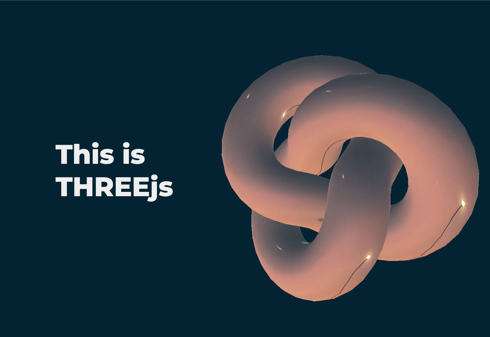

# This Is 3js

This was my first attempt at using threejs for a project. I am looking forward to importing other bodels and textures without the use of a CDN. The inition non-CDN version kept crashing and would load.

## Outside CDNs and Sources

- [Three.js CDN](https://cdnjs.cloudflare.com/ajax/libs/three.js/r99/three.min.js).
- [Google Fonts](https://fonts.google.com/specimen/Montserrat?query=Montserrat).
- [Pexels.com](https://images.pexels.com/photos/11635803/pexels-photo-11635803.jpeg).
